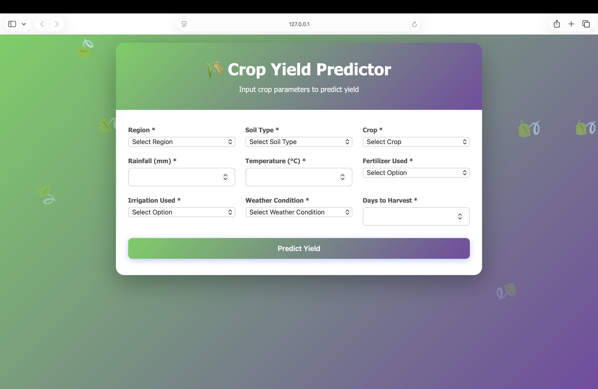
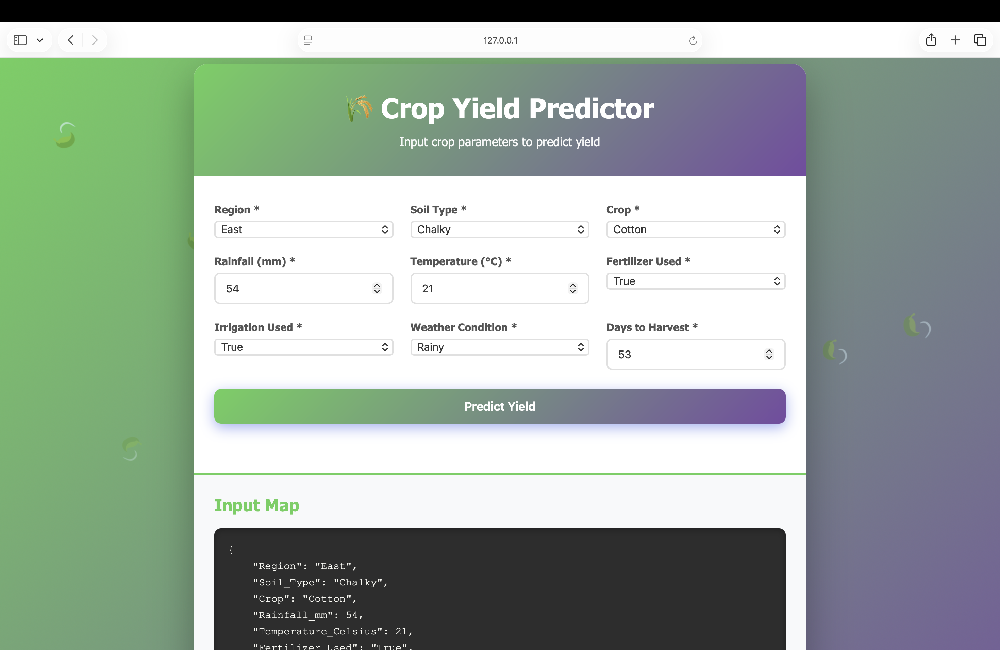
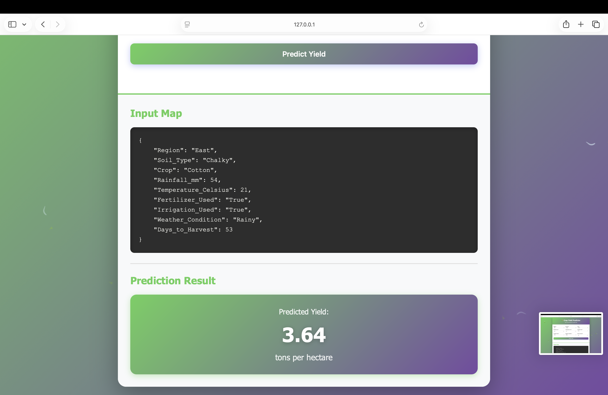

# 🌾 Crop Yield Predictor - Machine Learning Model

A LightGBM-based regression model that predicts crop yield (tons per hectare) based on various agricultural factors.

## 📋 Table of Contents

- [Project Overview](#project-overview)
- [Model Description](#model-description)
- [Prerequisites & Package Requirements](#prerequisites--package-requirements)
- [Project Structure](#project-structure)
- [Training the Model](#training-the-model)
- [Testing the Model](#testing-the-model)
- [Running the Web Interface](#running-the-web-interface)

## 🎯 Project Overview

This project implements a machine learning model to predict crop yield based on multiple agricultural features. The model uses LightGBM (Light Gradient Boosting Machine) for regression and achieves high prediction accuracy.

**Model Performance:**
- **R² Score:** 0.912 (91.2% variance explained)
- **RMSE:** 0.503 tons/hectare
- **MAE:** 0.401 tons/hectare
- **MAPE:** ~12%

## 📊 Model Description

### Input Features

The model predicts crop yield based on the following features:

| Feature | Type | Values/Description |
|---------|------|-------------------|
| **Region** | Categorical | East, North, South, West |
| **Soil Type** | Categorical | Chalky, Clay, Loam, Peaty, Sandy, Silt |
| **Crop** | Categorical | Barley, Cotton, Maize, Rice, Soybean, Wheat |
| **Rainfall_mm** | Numerical | Rainfall in millimeters |
| **Temperature_Celsius** | Numerical | Temperature in Celsius |
| **Fertilizer_Used** | Categorical | True, False |
| **Irrigation_Used** | Categorical | True, False |
| **Weather_Condition** | Categorical | Cloudy, Rainy, Sunny |
| **Days_to_Harvest** | Numerical | Number of days until harvest |

### Output

- **Yield_tons_per_hectare**: Continuous label (predicted crop yield)

### Dataset

- **Size:** 1,000,000 rows
- **Features:** 9 input features + 1 target variable
- **Train/Val/Test Split:** 70% / 15% / 15%
- **Source:** [Agriculture Crop Yield Dataset](https://www.kaggle.com/datasets/samuelotiattakorah/agriculture-crop-yield) on Kaggle by Samuel Oti Attakorah

## 🔧 Prerequisites & Package Requirements

### Required Python Packages

Before running the model training notebook, install the following packages:

```bash
pip install pandas numpy matplotlib seaborn lightgbm scikit-learn==1.6.1 joblib jupyter
```

Or install from requirements file (if provided):
```bash
pip install -r requirements.txt
```

### Specific Version Requirements

- **scikit-learn:** Version 1.6.1 (important for pipeline compatibility)
- **lightgbm:** Latest version (requires libomp on macOS)
- **Python:** 3.8 or higher

### macOS Additional Requirement

If running on macOS, LightGBM requires the OpenMP library:

```bash
# Install Homebrew (if not installed)
/bin/bash -c "$(curl -fsSL https://raw.githubusercontent.com/Homebrew/install/HEAD/install.sh)"

# Install libomp
brew install libomp
```

### Google Colab

If using Google Colab, no additional setup is required. The required packages are pre-installed, but you may need to install specific versions:

```python
!pip install scikit-learn==1.6.1
```

## 📁 Project Structure

```
Crop-Yield-Predictor/
├── Model/
│   ├── crop_yield.csv                    # Dataset (1M rows, 10 columns)
│   └── Intro_to_AI_Project_Crop_Yield_Predictor.ipynb  # Model training notebook
├── website/                              # Web interface for testing (optional)
│   ├── app.py                            # Flask backend
│   ├── crop_yield_pipeline.pkl          # Trained model pipeline
│   └── ...                               # Frontend files
└── README.md                             # This file
```

**📦 All files are available on Google Drive (anyone with link can access):** [Open Drive Folder](https://drive.google.com/drive/folders/1--ALCX6S1r0--bYt7pGUqIMDJ3Y1Dpc2?usp=drive_link)

## 🚀 Training the Model

### Option 1: Training in Google Colab (Recommended)

Google Colab provides free GPU access and pre-installed packages, making it ideal for training large models.

#### Quick Start: Direct Access via Google Drive

All project files are available in a shared Google Drive folder. **No downloads needed!**

📦 **Google Drive Folder:** [Open Project Files](https://drive.google.com/drive/folders/1--ALCX6S1r0--bYt7pGUqIMDJ3Y1Dpc2?usp=drive_link)

The drive contains:
- `crop_yield.csv` - Dataset (1M rows)
- `Intro to AI Project - Crop Yield Predictor.ipynb` - Training notebook
- `crop_yield_pipeline.pkl` - Pre-trained model (optional, for testing)
- Additional project documentation

#### Step 1: Open Notebook in Google Colab

1. **Go to the Google Drive link above**
2. **Open the notebook file:** `Intro to AI Project - Crop Yield Predictor.ipynb`
3. **Click "Open with" → "Google Colab"** (or right-click → Open with → Google Colab)

The notebook will open directly in Colab with all files accessible from the same Drive folder.

#### Step 2: Configure the Notebook for Colab

The notebook is already configured for Google Colab. **In Cell 6**, make sure the Colab configuration is active:

```python
#Mount google drive
from google.colab import drive
drive.mount('/content/drive', force_remount=True)

#set the path - UPDATE THIS PATH TO THE DRIVE FOLDER PATH
data_path = "/content/drive/MyDrive/path/to/crop_yield.csv"  # Update with the actual folder path
```

**Comment out** the local path:
```python
# data_path = "crop_yield.csv"  # Comment this out when using Colab
```

**Important:** Update the path in Cell 6 to point to where the `crop_yield.csv` file is located in your Google Drive. The path should match the folder structure where you opened the notebook from.

#### Step 3: Update Save Path (Cell 42)

**In Cell 42**, configure where to save the trained pipeline (same folder as the CSV):

```python
# Save pipeline to Google Drive - UPDATE THIS PATH TO MATCH YOUR DRIVE FOLDER
save_path = '/content/drive/MyDrive/path/to/crop_yield_pipeline.pkl'  # Update with the same folder path
```

#### Step 4: Run the Notebook

1. Run all cells sequentially (Cell 0 → Cell 44)
2. The model will train and save the pipeline to your Google Drive
3. Download `crop_yield_pipeline.pkl` from Google Drive for local use (if needed)

### Option 2: Training Locally

#### Step 1: Install Prerequisites

Make sure you have all required packages installed (see [Prerequisites](#prerequisites--package-requirements)).

#### Step 2: Configure the Notebook for Local Execution

**In Cell 6**, use the local configuration:

```python
# Comment out Colab-specific code
# #Mount google drive
# from google.colab import drive
# drive.mount('/content/drive', force_remount=True)
# 
# #set the path
# data_path = "/content/drive/MyDrive/Crop_Yield_Predictor_Project/crop_yield.csv"

# Use local path instead
data_path = "crop_yield.csv"  # CSV file is in the same directory as the notebook
```

#### Step 3: Update Save Path (Cell 42)

**In Cell 42**, save the pipeline locally:

```python
# Save pipeline to website directory for web interface
save_path = '../website/crop_yield_pipeline.pkl'
```

Or save to current directory:
```python
save_path = 'crop_yield_pipeline.pkl'
```

#### Step 4: Run the Notebook

```bash
# Navigate to Model directory
cd Model

# Start Jupyter Notebook
jupyter notebook Intro_to_AI_Project_Crop_Yield_Predictor.ipynb
```

Run all cells sequentially to:
1. Load and explore the dataset
2. Preprocess categorical features
3. Split data into train/validation/test sets
4. Train the LightGBM model
5. Evaluate model performance
6. Save the trained pipeline

### Configuration Summary

| Setting | Google Colab | Local |
|---------|-------------|-------|
| **Cell 6 - Data Path** | Google Drive path: `/content/drive/MyDrive/.../crop_yield.csv` | Local path: `"crop_yield.csv"` |
| **Cell 6 - Drive Mount** | **Uncomment** `drive.mount()` | **Comment out** `drive.mount()` |
| **Cell 42 - Save Path** | Google Drive path: `/content/drive/MyDrive/.../crop_yield_pipeline.pkl` | Local path: `'../website/crop_yield_pipeline.pkl'` or `'crop_yield_pipeline.pkl'` |

### Model Training Details

The model is configured with the following hyperparameters:

```python
LGBMRegressor(
    objective='regression',
    num_leaves=50,
    max_depth=20,
    learning_rate=0.01,
    n_estimators=5000,
    min_child_samples=20,
    random_state=42
)
```

**Training Process:**
- Uses early stopping with validation set
- Evaluates using RMSE (Root Mean Squared Error)
- Handles categorical features automatically
- Trains for up to 5000 boosting iterations

## 🧪 Testing the Model

### Using the Saved Pipeline

After training, you can test the model using the saved pipeline:

```python
import joblib
import pandas as pd

# Load the pipeline
pipeline = joblib.load('crop_yield_pipeline.pkl')

# Prepare test data
data_point = {
    "Region": 'North',
    "Soil_Type": 'Loam',
    "Crop": 'Barley',
    "Rainfall_mm": 144,
    "Temperature_Celsius": 32,
    "Fertilizer_Used": 'False',
    "Irrigation_Used": 'False',
    "Weather_Condition": 'Rainy',
    "Days_to_Harvest": 106
}

# Convert to DataFrame and make prediction
test_df = pd.DataFrame([data_point])
prediction = pipeline.predict(test_df)
print(f"Predicted yield: {prediction[0]:.2f} tons per hectare")
```

## 🌐 Running the Web Interface

The web interface allows you to interactively test the model through a user-friendly form. You need to run it locally on your machine.





### Web Interface (Optional Testing Tool)

A web interface is provided in the `website/` directory for interactive testing. This is a demonstration/testing tool and not the main focus of this project.

#### Requirements for Running the Website

**System Requirements:**
- Python 3.8 or higher
- pip (Python package manager)
- Web browser (Chrome, Firefox, Safari, Edge)
- **macOS users:** Homebrew (for installing libomp)

**Python Packages Required:**
- Flask >= 3.0.0
- Flask-CORS >= 4.0.0
- pandas >= 2.2.0
- numpy >= 1.26.0
- scikit-learn == 1.6.1
- joblib >= 1.3.0
- lightgbm >= 4.6.0

#### Step-by-Step Setup Instructions

**Step 1: Install System Dependencies (macOS Only)**

If you're on macOS, install Homebrew and libomp (required for LightGBM):

```bash
# Install Homebrew (if not already installed)
/bin/bash -c "$(curl -fsSL https://raw.githubusercontent.com/Homebrew/install/HEAD/install.sh)"

# Install libomp
brew install libomp
```

**Step 2: Install Python Dependencies**

Navigate to the website directory and install required packages:

```bash
cd website
pip3 install flask flask-cors pandas numpy scikit-learn==1.6.1 joblib lightgbm
```

Or create a `requirements.txt` file and install from it:

```bash
# Create requirements.txt with the packages listed above, then:
pip3 install -r requirements.txt
```

**Step 3: Verify Model Pipeline File**

Ensure the trained model pipeline is in the `website/` directory:

```bash
ls website/crop_yield_pipeline.pkl
```

If the file doesn't exist:
- Download it from the [Google Drive folder](https://drive.google.com/drive/folders/1--ALCX6S1r0--bYt7pGUqIMDJ3Y1Dpc2?usp=drive_link)
- Or train the model first (see [Training the Model](#training-the-model) section)

**Step 4: Start the Backend Server**

Open a terminal and start the Flask backend:

```bash
cd website

# Set environment variables for libomp (macOS only)
export LDFLAGS="-L/opt/homebrew/opt/libomp/lib"
export CPPFLAGS="-I/opt/homebrew/opt/libomp/include"

# Start Flask server
python3 app.py
```

You should see:
```
✓ Pipeline loaded successfully!
 * Running on http://127.0.0.1:5001
```

**Keep this terminal open** - the Flask server needs to keep running.

**Step 5: Start the Frontend Server**

Open a **new terminal** window and start the frontend:

```bash
cd website
python3 -m http.server 8000
```

You should see:
```
Serving HTTP on :: port 8000
```

**Alternative:** Use VS Code's Live Server extension:
1. Right-click on `website/index.html`
2. Select "Open with Live Server"

**Step 6: Access the Website**

Open your web browser and navigate to:
```
http://localhost:8000
```

Fill out the form and click **"Predict Yield"** to get predictions!

#### Running the Website - Quick Reference

**Terminal 1 (Backend - Flask):**
```bash
cd website
export LDFLAGS="-L/opt/homebrew/opt/libomp/lib"
export CPPFLAGS="-I/opt/homebrew/opt/libomp/include"
python3 app.py
```

**Terminal 2 (Frontend - Static Server):**
```bash
cd website
python3 -m http.server 8000
```

**Browser:**
- Go to: `http://localhost:8000`

#### Troubleshooting Website Issues

**Error: "Pipeline not loaded"**
- Make sure `crop_yield_pipeline.pkl` is in the `website/` directory
- Check that the pipeline file downloaded correctly (should be ~23MB)
- Verify the Flask server started successfully (check terminal for "✓ Pipeline loaded successfully!")

**Error: "Error connecting to prediction server"**
- Make sure Flask backend is running on port 5001 (check Terminal 1)
- Verify the backend is accessible: `curl http://localhost:5001/`
- Check that port 5001 is not blocked by firewall

**Error: "No module named 'flask'" or missing packages**
- Install all required packages: `pip3 install flask flask-cors pandas numpy scikit-learn==1.6.1 joblib lightgbm`
- Make sure you're using Python 3.8 or higher: `python3 --version`

**Port already in use**
- For port 5001: Kill existing process: `lsof -ti:5001 | xargs kill -9`
- For port 8000: Kill existing process: `lsof -ti:8000 | xargs kill -9`
- Or use different ports in the code

## 📝 Notes

- The model uses **OrdinalEncoder** for categorical feature preprocessing, which is included in the saved pipeline
- The dataset contains 1 million rows - training may take significant time depending on your hardware
- For best performance, use Google Colab with GPU acceleration
- Model performance metrics are evaluated on the test set after training

## 🔍 Troubleshooting

### Error: "No module named 'lightgbm'"

**Solution:**
```bash
pip install lightgbm
```

On macOS, also install libomp:
```bash
brew install libomp
```

### Error: "scikit-learn version mismatch"

**Solution:**
The pipeline was trained with scikit-learn 1.6.1. Install the matching version:
```bash
pip install scikit-learn==1.6.1
```

### Error: Cannot load pipeline on different Python version

**Solution:**
Ensure you're using the same Python version (3.8+) and package versions as when the model was trained.

### Out of Memory Error

**Solution:**
- Use Google Colab with more RAM
- Reduce dataset size for testing: `crop_data = crop_data.head(100000)`
- Adjust model parameters (reduce `n_estimators` or `num_leaves`)

### Website: "Error connecting to prediction server"

**Solution:**
- Ensure Flask backend is running: Check Terminal 1 for Flask server
- Verify backend is accessible: `curl http://localhost:5001/`
- Check that both servers are running:
  - Backend on port 5001 (Flask)
  - Frontend on port 8000 (HTTP server)
- Hard refresh browser: `Cmd + Shift + R` (Mac) or `Ctrl + Shift + R` (Windows)

### Website: "Pipeline not loaded" error

**Solution:**
- Verify `crop_yield_pipeline.pkl` exists in `website/` directory
- Check file size (should be ~23MB)
- Download from Google Drive if missing
- Ensure Flask server shows "✓ Pipeline loaded successfully!" when starting

## 📚 Technologies & Libraries

- **LightGBM:** Gradient boosting framework for model training
- **scikit-learn:** Data preprocessing and pipeline management
- **pandas:** Data manipulation and analysis
- **numpy:** Numerical computations
- **matplotlib/seaborn:** Data visualization

## 📚 Dataset Source

The dataset used in this project is from Kaggle:

**Dataset:** [Agriculture Crop Yield Dataset](https://www.kaggle.com/datasets/samuelotiattakorah/agriculture-crop-yield)  
**Author:** Samuel Oti Attakorah  
**License:** Check Kaggle dataset page for license information

## 👥 Authors

**Group 10:**
- Hieu Truong
- Esmeralda Camille
- Suraya Begum

Created as part of an Intro to AI course project.

---

**Note:** The web interface in the `website/` directory is provided for demonstration and testing purposes only. The main focus of this project is the machine learning model itself.
